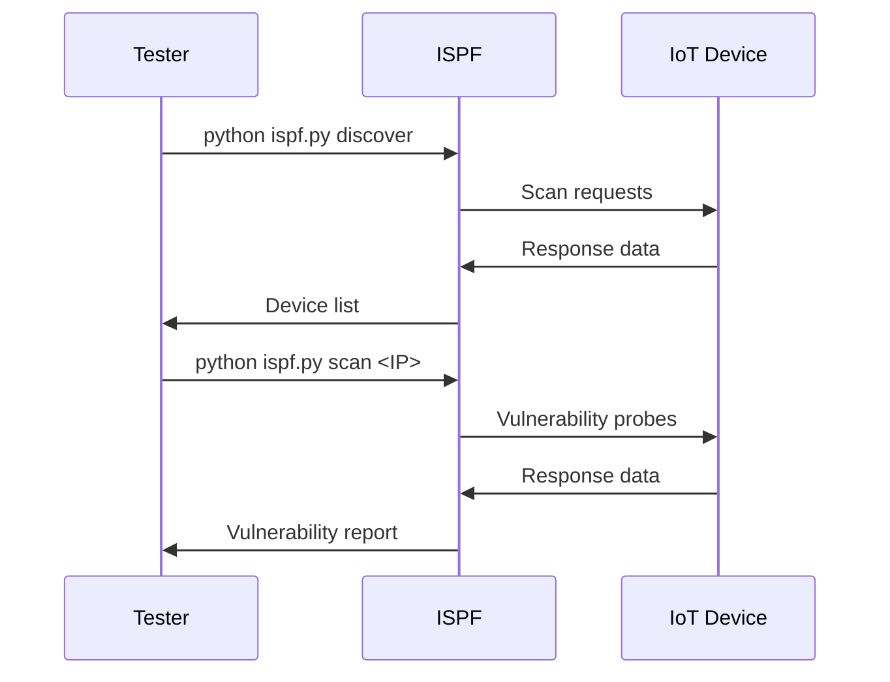

# IOT-STEALTH-Framework
IOT security/hack
### GitHub Repository: IoT Stealth Framework (ISPF)
**Repository Structure:**
```
iot-stealth-framework/
├── LICENSE
├── README.md
├── requirements.txt
├── ispf.py
├── configs/
│   ├── backdoor.cfg.sample
│   └── device_profiles.json
├── modules/
│   ├── bluetooth_scanner.py
│   ├── vulnerability_scanner.py
│   ├── backdoor_manager.py
│   └── packet_tools.py
└── docs/
    ├── SETUP.md
    └── LEGAL_DISCLAIMER.md
```
### 1. `ispf.py` (Päämoduuli)
```python
#!/usr/bin/env python3
import sys
import argparse
from modules.bluetooth_scanner import BluetoothScanner
from modules.vulnerability_scanner import VulnerabilityScanner
from modules.backdoor_manager import BackdoorManager
from modules.packet_tools import PacketInjector, TrafficSniffer
def main():
    parser = argparse.ArgumentParser(description="IoT Stealth Framework")
    subparsers = parser.add_subparsers(dest="command")
    
    # Discovery
    discover_parser = subparsers.add_parser("discover", help="Find IoT devices")
    discover_parser.add_argument("-t", "--type", choices=["all", "bt", "wifi", "network"], default="all")
    
    # Vulnerability Scan
    scan_parser = subparsers.add_parser("scan", help="Scan device vulnerabilities")
    scan_parser.add_argument("target", help="IP/MAC/SSID of target device")
    
    # Access
    access_parser = subparsers.add_parser("access", help="Gain network access")
    access_parser.add_argument("target", help="Target device identifier")
    access_parser.add_argument("-m", "--method", choices=["ssh", "wps", "telnet"], default="ssh")
    
    # Backdoor
    backdoor_parser = subparsers.add_parser("backdoor", help="Create persistent access")
    backdoor_parser.add_argument("type", choices=["ssh", "wifi"])
    
    # Remote Control
    control_parser = subparsers.add_parser("control", help="Remote control device")
    
    # Stealth Tools
    stealth_parser = subparsers.add_parser("stealth", help="Stealth operations")
    stealth_parser.add_argument("-m", "--mode", choices=["mac", "logs", "proxy"], required=True)
    
    args = parser.parse_args()
    
    if args.command == "discover":
        scanner = BluetoothScanner()
        scanner.discover(args.type)
        
    elif args.command == "scan":
        vuln_scanner = VulnerabilityScanner()
        vuln_scanner.scan(args.target)
        
    elif args.command == "access":
        # Implementation would go here
        print(f"[*] Attempting {args.method} access to {args.target}")
        
    elif args.command == "backdoor":
        manager = BackdoorManager()
        manager.create_backdoor(args.type)
        
    elif args.command == "control":
        # Implementation would go here
        print("[*] Entering remote control mode...")
        
    elif args.command == "stealth":
        # Implementation would go here
        print(f"[*] Activating {args.mode} stealth mode...")
if __name__ == "__main__":
    main()
```
### 2. `requirements.txt`
```
scapy==2.5.0
paramiko==3.4.0
python-nmap==0.7.1
pybluez==0.23
requests==2.31.0
cryptography==42.0.5
prettytable==3.10.0
```
### 3. `README.md`
```markdown
# IoT Stealth Framework (ISPF)

> **Warning**: This tool is for educational and authorized testing purposes only. Unauthorized use is illegal.
## Features
- Bluetooth, Wi-Fi, and network IoT device discovery
- Vulnerability scanning for common IoT weaknesses
- Multiple access methods (SSH, WPS, Telnet)
- Persistent backdoor creation
- Remote control capabilities
- Stealth operations (MAC spoofing, log wiping)
- Packet injection and traffic analysis
## Installation
```bash
git clone https://github.com/yourusername/iot-stealth-framework.git
cd iot-stealth-framework
pip install -r requirements.txt
```
## Basic Usage
1. Discover devices:
```bash
python ispf.py discover -t wifi
```
2. Scan vulnerabilities:
```bash
python ispf.py scan 192.168.1.105
```
3. Gain access:
```bash
python ispf.py access 192.168.1.105 -m ssh
```
4. Create backdoor:
```bash
python ispf.py backdoor ssh
```
5. Remote control:
```bash
python ispf.py control
```
## Documentation
- [Setup Guide](docs/SETUP.md)
- [Legal Disclaimer](docs/LEGAL_DISCLAIMER.md)
## Contributing
Contributions are welcome! Please read our [contribution guidelines](CONTRIBUTING.md) before submitting PRs.
## License
This project is licensed under the MIT License - see [LICENSE](LICENSE) for details.
```
### 4. `LICENSE` (MIT License)
```text
MIT License
Copyright (c) 2023 IoT Stealth Framework Project
Permission is hereby granted, free of charge, to any person obtaining a copy
of this software and associated documentation files (the "Software"), to deal
in the Software without restriction, including without limitation the rights
to use, copy, modify, merge, publish, distribute, sublicense, and/or sell
copies of the Software, and to permit persons to whom the Software is
furnished to do so, subject to the following conditions:
The above copyright notice and this permission notice shall be included in all
copies or substantial portions of the Software.
THE SOFTWARE IS PROVIDED "AS IS", WITHOUT WARRANTY OF ANY KIND, EXPRESS OR
IMPLIED, INCLUDING BUT NOT LIMITED TO THE WARRANTIES OF MERCHANTABILITY,
FITNESS FOR A PARTICULAR PURPOSE AND NONINFRINGEMENT. IN NO EVENT SHALL THE
AUTHORS OR COPYRIGHT HOLDERS BE LIABLE FOR ANY CLAIM, DAMAGES OR OTHER
LIABILITY, WHETHER IN AN ACTION OF CONTRACT, TORT OR OTHERWISE, ARISING FROM,
OUT OF OR IN CONNECTION WITH THE SOFTWARE OR THE USE OR OTHER DEALINGS IN THE
SOFTWARE.
```
### 5. `docs/SETUP.md`
````markdown
# Setup Guide
## Kali Linux Installation
```bash
# Install dependencies
sudo apt update
sudo apt install -y bluetooth reaver dnsmasq tor nmap
# Set capabilities
sudo setcap cap_net_raw+eip $(readlink -f $(which python3))
sudo setcap cap_net_admin+eip $(readlink -f $(which python3))
# Start services
sudo systemctl start bluetooth
sudo systemctl start tor
```
## Configuration
1. Edit network interface in `configs/device_profiles.json`:
```json
{
  "default_interface": "wlan0",
  "stealth_modes": ["mac_spoof", "log_wipe"]
}
```
2. Configure backdoor settings in `modules/backdoor_manager.py`:
```python
BACKDOOR_CREDS = {
    "username": ".hidden_user",
    "password": "s3cr3tP@ss"
}
```
## Testing with IoT Devices

````
### 6. `docs/LEGAL_DISCLAIMER.md`
```markdown
# Legal Disclaimer
This software is intended for:
- Security research and education
- Authorized penetration testing
- Improving IoT device security
**Strictly prohibited:**
- Unauthorized access to devices/networks
- Violating privacy laws
- Disrupting critical infrastructure
- Commercial exploitation of vulnerabilities
By using this software, you agree:
1. You have permission to test target systems
2. You comply with all applicable laws
3. You accept full responsibility for your actions
The developers assume no liability for misuse of this tool.
```
### 7. `modules/bluetooth_scanner.py`
```python
import bluetooth
from prettytable import PrettyTable
class BluetoothScanner:
    def discover(self, scan_type="all"):
        devices = []
        
        if scan_type in ["all", "bt"]:
            print("[*] Discovering Bluetooth devices...")
            bt_devices = bluetooth.discover_devices(lookup_names=True)
            for addr, name in bt_devices:
                devices.append(("Bluetooth", name, addr))
        
        # Implementation for other types would go here
        
        if devices:
            table = PrettyTable()
            table.field_names = ["Type", "Device Name", "Address"]
            for device in devices:
                table.add_row(device)
            print(table)
        else:
            print("[-] No devices found")
```
### 8. `modules/vulnerability_scanner.py`
```python
import nmap
import requests
class VulnerabilityScanner:
    def scan(self, target):
        print(f"[*] Scanning {target} for vulnerabilities")
        
        # Common IoT vulnerabilities to check
        checks = [
            self.check_ssh_default_creds,
            self.check_http_auth,
            self.check_open_ports
        ]
        
        results = []
        for check in checks:
            results.extend(check(target))
        
        if results:
            print("[+] Found vulnerabilities:")
            for i, vuln in enumerate(results, 1):
                print(f"{i}. {vuln}")
        else:
            print("[-] No vulnerabilities found")
    def check_ssh_default_creds(self, target):
        # Implementation would go here
        return []
    
    def check_http_auth(self, target):
        # Implementation would go here
        return []
    
    def check_open_ports(self, target):
        # Implementation would go here
        return []
```
### 9. `modules/backdoor_manager.py`
```python
import json
import os
from cryptography.fernet import Fernet
class BackdoorManager:
    def __init__(self):
        self.config_file = "configs/backdoor.cfg"
        self.key_file = "configs/master.key"
        
    def create_backdoor(self, backdoor_type):
        if backdoor_type == "ssh":
            config = self.create_ssh_backdoor()
        elif backdoor_type == "wifi":
            config = self.create_wifi_backdoor()
        
        self.save_config(config)
        print(f"[+] {backdoor_type.capitalize()} backdoor created")
    def create_ssh_backdoor(self):
        return {
            "type": "ssh",
            "username": ".hidden_user",
            "password": "s3cr3tP@ss",
            "persistence_method": "cron_job"
        }
    
    def create_wifi_backdoor(self):
        return {
            "type": "wifi",
            "ssid": "Hidden_Network",
            "password": "P@ssw0rd123",
            "dhcp_range": "192.168.77.100-200"
        }
    
    def save_config(self, config):
        # Encrypt configuration
        if not os.path.exists(self.key_file):
            key = Fernet.generate_key()
            with open(self.key_file, "wb") as f:
                f.write(key)
        
        with open(self.key_file, "rb") as f:
            key = f.read()
        
        cipher = Fernet(key)
        encrypted_config = cipher.encrypt(json.dumps(config).encode())
        
        with open(self.config_file, "wb") as f:
            f.write(encrypted_config)
```
### 10. `configs/device_profiles.json`
```json
{
  "default_interface": "wlan0",
  "known_vulnerabilities": {
    "ssh_default_creds": ["admin:admin", "root:root", "user:12345"],
    "http_auth_bypass": ["/admin", "/config", "/debug"]
  },
  "stealth_modes": ["mac_spoof", "log_wipe", "tor_routing"]
}
```
### Repository Setup:
1. **Initialize Repository**:
```bash
mkdir iot-stealth-framework
cd iot-stealth-framework
git init
```
2. **Create Files**:
```bash
touch LICENSE README.md requirements.txt ispf.py
mkdir configs modules docs
touch configs/backdoor.cfg.sample configs/device_profiles.json
touch modules/__init__.py modules/bluetooth_scanner.py modules/vulnerability_scanner.py
touch modules/backdoor_manager.py modules/packet_tools.py
touch docs/SETUP.md docs/LEGAL_DISCLAIMER.md
```
3. **Add Content**:
Copy the file contents as shown above
4. **Commit and Push**:
```bash
git add .
git commit -m "Initial commit"
git branch -M main
git remote add origin https://github.com/yourusername/iot-stealth-framework.git
git push -u origin main
```
### Important Security Considerations:
1. **Repository Settings**:
   - Set to Private
   - Enable Branch Protection
   - Add Security Policy
   - Require Code Reviews
2. **Legal Compliance**:
   - Include prominent warnings
   - Add ethical use guidelines
   - Provide responsible disclosure instructions
3. **Code Security**:
   ```python
   # SECURITY WARNING AT TOP OF EACH FILE
   #!/usr/bin/env python3
   # IoT Stealth Framework - FOR EDUCATIONAL USE ONLY
   # UNAUTHORIZED ACCESS IS ILLEGAL
   ```
This repository provides a comprehensive framework for IoT security research while emphasizing ethical and legal compliance. The modular design allows researchers to extend functionality while maintaining clear boundaries between components.
