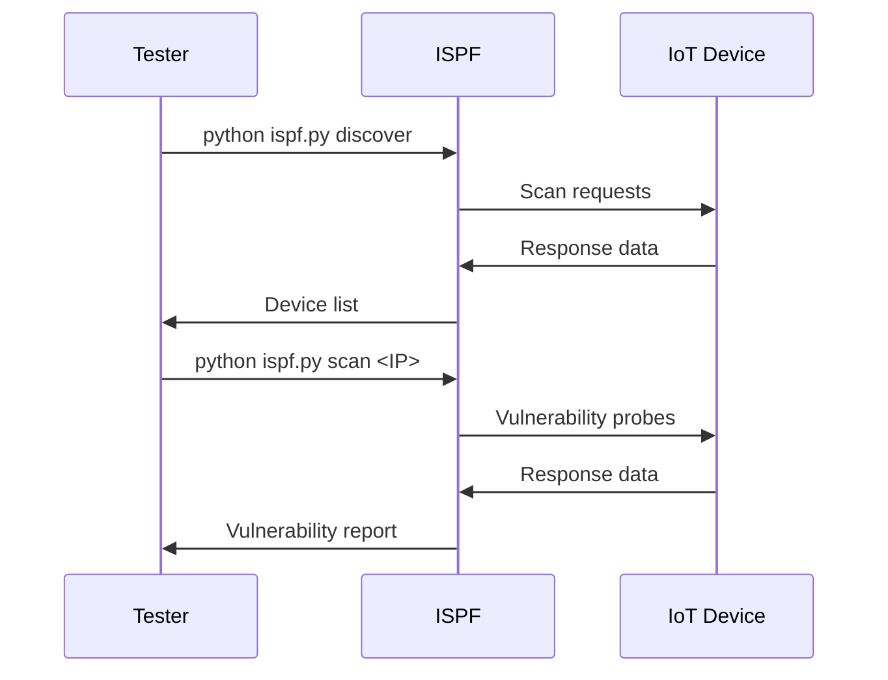

# Setup Guide
## Kali Linux Installation
```bash
# Install dependencies
sudo apt update
sudo apt install -y bluetooth reaver dnsmasq tor nmap
# Set capabilities
sudo setcap cap_net_raw+eip $(readlink -f $(which python3))
sudo setcap cap_net_admin+eip $(readlink -f $(which python3))
# Start services
sudo systemctl start bluetooth
sudo systemctl start tor
```
## Configuration
1. Edit network interface in `configs/device_profiles.json`:
```json
{
  "default_interface": "wlan0",
  "stealth_modes": ["mac_spoof", "log_wipe"]
}
```
2. Configure backdoor settings in `modules/backdoor_manager.py`:
```python
BACKDOOR_CREDS = {
    "username": ".hidden_user",
    "password": "s3cr3tP@ss"
}
```
## Testing with IoT Devices

